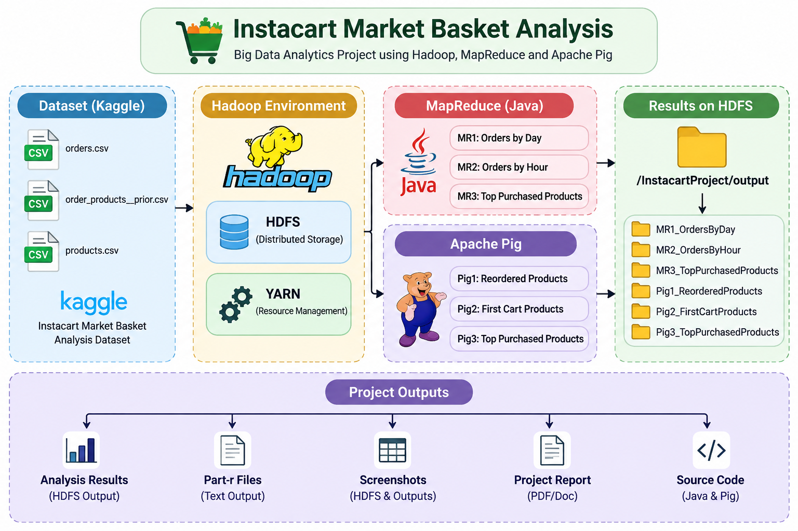
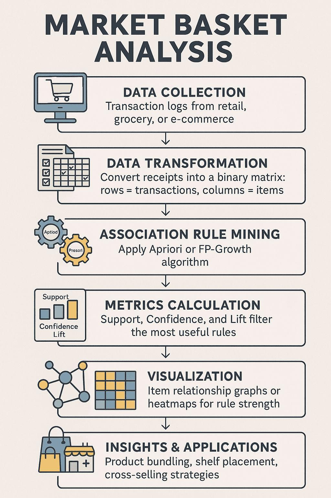

# Instacart Market Basket Big Data Analytics

A Big Data Analytics project that analyzes the **Instacart Market Basket Analysis Dataset** using **Apache Hadoop**, **Java MapReduce**, and **Apache Pig**. This project was developed as part of a university Big Data Analytics Laboratory course and demonstrates distributed data processing on a Hadoop single-node cluster.

---

## Project Overview

The Instacart Market Basket Analysis dataset was uploaded to the Hadoop Distributed File System (HDFS) and analyzed using Java MapReduce programs and Apache Pig scripts. The project demonstrates how large-scale transaction data can be processed efficiently in a distributed environment.

The project performs the following analyses:

* Count orders by day of the week
* Count orders by hour of the day
* Identify the most purchased products
* Extract reordered products
* Find products added first to the cart
* Generate top purchased products using Apache Pig
* Analyze weekend orders using Apache Pig
* Count products by department using Apache Pig

---

## Hadoop Architecture

The following figure illustrates the Hadoop ecosystem used in this project.



---

## Project Workflow

The following diagram shows how the Instacart dataset flows through HDFS, Java MapReduce, and Apache Pig before generating distributed outputs.



---

## Technologies Used

* Apache Hadoop (HDFS)
* Java MapReduce
* Apache Pig
* Windows Single-Node Hadoop Cluster

---

## Repository Structure

```text
Instacart-BigData-Analytics/
│
├── Dataset/
│   ├── products.csv
│   └── README.txt
│
├── MapReduce/
│   ├── MR1_OrdersByDay/
│   ├── MR2_OrdersByHour/
│   └── MR3_TopPurchasedProducts/
│
├── Pig/
│   ├── Pig1_ReorderedProducts/
│   ├── Pig2_FirstCartProducts/
│   ├── Pig3_TopPurchasedProducts/
│   ├── Pig4_WeekendOrders/
│   └── Pig5_ProductCountByDepartment/
│
├── Outputs/
│   ├── MR1_OrdersByDay/
│   ├── MR2_OrdersByHour/
│   ├── MR3_TopPurchasedProducts/
│   ├── Pig1_ReorderedProducts/
│   ├── Pig2_FirstCartProducts/
│   ├── Pig3_TopPurchasedProducts/
│   ├── Pig4_WeekendOrders/
│   └── Pig5_DepartmentCount/
│
├── Report/
│
├── Images/
│   ├── hadoop_architecture.png
│   └── instacart_workflow.png
│
├── README.md
└── .gitignore
```

---

## Dataset Description

The project uses the **Instacart Market Basket Analysis Dataset**, a real-world retail transaction dataset containing customer orders, product information, aisles, and departments. The data is suitable for Hadoop-based distributed processing and market basket analysis.

Key dataset files include:

* `orders.csv` – Customer order history.
* `products.csv` – Product information.
* `order_products__prior.csv` – Products from previous orders.
* `order_products__train.csv` – Training order-product data.
* `aisles.csv` – Aisle information.
* `departments.csv` – Department information.

---

## Typical Analytics Workflow

1. Upload the dataset to HDFS.
2. Process transactional data using Java MapReduce.
3. Execute Apache Pig scripts for additional analytics.
4. Store generated results in the `Outputs` directory.
5. Interpret the results for customer purchasing behavior analysis.

---

## Learning Outcomes

This project demonstrates:

* Distributed data processing with Hadoop.
* Java MapReduce implementation.
* Apache Pig scripting for data analysis.
* Customer purchasing behavior analysis.
* Big data workflow execution on a Hadoop cluster.

---

## Notes

* The repository contains the datasets, Hadoop processing modules, Apache Pig scripts, generated outputs, and supporting project documentation.
* The included architecture and workflow diagrams illustrate how data flows through the Hadoop ecosystem.
* The project serves as a practical implementation of Big Data Analytics concepts using the Instacart dataset.

---

## License

This repository is intended for educational and academic purposes.
